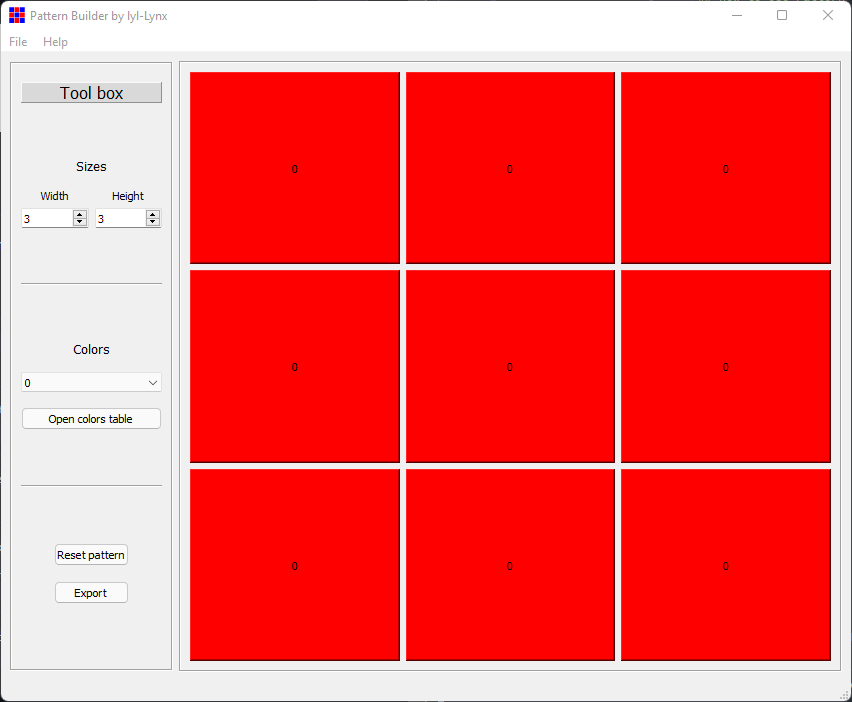

# Pattern Builder by greg-ynx
Pattern Builder is a tool that graphically constructs matrix.

## How to use Pattern Builder ?

### Sizes
Select the size of your matrix with the width and eight select components.
- Width : Number of columns (max = 16).
- Eight : Number of rows (max = 16).

### Colors
You can add up to 16 colors to your pattern. Then select your color with the select component.

### Reset pattern
Click on the "Reset pattern" button in order to get back to the initial pattern.

### Export
You can export your pattern into an array.
Pattern Builder currently supports :
- Text file (.txt)
- JSON file (.json)
- CSV file (.csv)
- Tabler file (.xlsx)

## Credits
This application is built with Python programming language and QtDesigner software.
Dependencies used are PyQt5 and XlsxWriter.